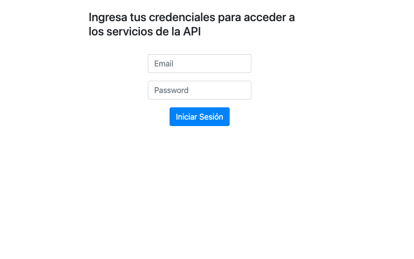

# Nombre del Proyecto

Descripción corta del proyecto y su propósito.

## Tecnologías Utilizadas

- PHP v8.2
- Laravel Framework v10
- MySQL (o MariaDB)
- Guzzle HTTP para la integración con la API de Giphy
- Laravel Passport para la autenticación OAuth2.0
- PHPUnit para pruebas unitarias
- UML para la documentación de diseño
- Docker para la contenerización de la aplicación

## Requisitos del Sistema

Asegúrate de tener instalado lo siguiente antes de iniciar la configuración del proyecto:

- PHP >= 8.2
- Composer
- Docker
- Git

## Instalación y Configuración

1. Clona el repositorio:

```bash
git clone https://github.com/fkronhaus/giphy
```

2. Edita el archivo hosts
    - Windows -> C:Windows\System32\drivers\etc\hosts
    - Linux/MacOs -> /etc/hosts

     Agrega la linea:
```
    127.0.0.1       giphyapi.com
```

3. Inicia el Contenedor
```
docker-compose up
```
4. Ve a tu navegador e ingresa en la url:

````
http://giphyapi.com:8000/
````

- Deberias ver la siguiente imagen:


Si puedes verla, tienes la aplicacion funcionando!


## Casos de Uso

### Caso de Uso 1: Autenticación de Usuario

Descripción:
Este caso de uso describe el proceso de autenticación de un usuario en la aplicación.

**Actores:**
- Usuario 1: 
    - Credenciales: 
        - Email: test1@email.com
        - Password: 1234

- Usuario 2: 
    - Credenciales: 
        - Email: test2@email.com
        - Password: 2345

**Flujo Principal:**
1. El usuario ingresa su nombre de usuario y contraseña.
2. El sistema verifica las credenciales del usuario.
3. Si las credenciales son válidas, el usuario es autenticado y dirigido a la página principal.
4. Si las credenciales son inválidas, el sistema muestra un mensaje de error y permite al usuario intentarlo nuevamente.

### Caso de Uso 2: Búsqueda de Imagenes

Descripción:
Este caso de uso describe cómo un usuario busca imagenes Gif en la aplicación.

**Actores:**
- Usuario 1 o Usuario 2

**Flujo Principal:**
1. El usuario ingresa un término de búsqueda en el campo de búsqueda.
2. El usuario puede, opcionalmente, establecer un limite de resultados y un offset.
3. El sistema muestra una lista de productos que coinciden con los datos proporcionados.

**Extensiones:**
- Si no se encuentran productos que coincidan con el término de búsqueda, el sistema muestra un mensaje indicando que se encontraron 0 resultados.

### Caso de Uso 3: Mostrar gif en tamaño original e información del mismo

Descripción:
Este caso de uso describe cómo un usuario puede ver mas informacion acerca de una imagen en la lista.

**Actores:**
- Usuario 1 o Usuario 2

**Flujo Principal:**
1. El usuario hace click en el boton "Mostrar info" situado debajo de cada imagen en el listado.
2. El sistema muestra un modal con la informacion solicitada
3. El usuario puede cerrar el modal

### Caso de Uso 4: Agregar un gif a favoritos del usuario que ha iniciado sesión

Descripción:
Este caso de uso describe cómo un usuario puede agregar un gif a sus favoritos

**Actores:**
- Usuario 1 o Usuario 2

**Flujo Principal:**
1. El usuario hace click en el boton "Agregar a favoritos" situado debajo de cada imagen en el listado.
2. El sistema realiza la peticion solicitada y muestra una alerta de confirmación
3. El usuario puede cerrar la alerta

### Caso de uso 5: el usuario intenta hacer una busqueda luego de que expirara su token de 30 minutos.

Descripcion: Luego de 30 minutos de iniciada la sesión, la autorizacion del usuario caduca y debe volver a iniciar sesion en la aplicación.

**Actores:**
- Usuario 1 o Usuario 2

**Flujo Principal:**
1. El usuario inicia sesion.
2. Luego de pasados los 30 minutos, realiza una busqueda de imagenes.
3. El usuario es redirigido a la pagina de inicio de sesion y la aplicación muestra un cartel indicando que la sesión ha expirado.

### Caso de uso 6: el usuario intenta mostrar informacion de un Gif luego de que expirara su token de 30 minutos.

Descripcion: Luego de 30 minutos de iniciada la sesión, la autorizacion del usuario caduca y debe volver a iniciar sesion en la aplicación.

**Actores:**
- Usuario 1 o Usuario 2

**Flujo Principal:**
1. El usuario inicia sesion.
2. Luego de pasados los 30 minutos, oprime el botón "Mostrar Info".
3. El usuario es redirigido a la pagina de inicio de sesion y la aplicación muestra un cartel indicando que la sesión ha expirado.

### Caso de uso 7: el usuario intenta agregar un Gif a sus favoritos luego de que expirara su token de 30 minutos.

Descripcion: Luego de 30 minutos de iniciada la sesión, la autorizacion del usuario caduca y debe volver a iniciar sesion en la aplicación.

**Actores:**
- Usuario 1 o Usuario 2

**Flujo Principal:**
1. El usuario inicia sesion.
2. Luego de pasados los 30 minutos, oprime el botón "Agregar a Favoritos".
3. El usuario es redirigido a la pagina de inicio de sesion y la aplicación muestra un cartel indicando que la sesión ha expirado.


